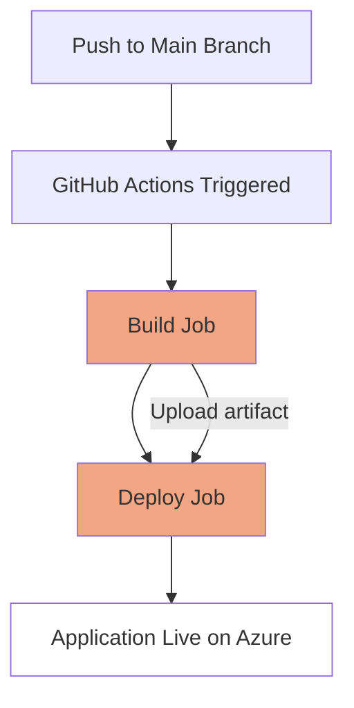

# A Study in CI/CD: Deploying an ASP.NET Core Application on Azure Web App

## Web Application
Before diving into the CI/CD details, feel free to explore the web application that we're going to discuss in this case study: [MyFirstAzureWebAppLucaMandelli](https://myfirstazurewebapplucamandelli.azurewebsites.net/).

## Introduction
This case study focuses on the application of Continuous Integration/Continuous Deployment (CI/CD) methodologies in the context of a basic ASP.NET Core Razor Pages application deployed on Microsoft Azure. The CI/CD pipeline is automated using GitHub Actions, demonstrating how such methodologies can streamline the process of deploying web applications.

## Repository Structure
The primary component of our study is an ASP.NET Core Razor Pages web application. Though it lacks complex functionalities, the application structure mirrors that of a real-world scenario, providing a tangible example of how CI/CD integrates into a typical development cycle.

The application is divided into two key directories:
- `./Models`: Though not used in this specific application, this directory usually houses the data model classes in an application.
- `./Pages`: This directory includes the Razor pages of our application, i.e., Error.cshtml, Index.cshtml, and other pages. The Razor syntax allows developers to weave C# and HTML in .cshtml files, providing a seamless coding experience.

## CI/CD Workflow Using GitHub Actions
The CI/CD pipeline is defined in the `.github/workflows/main.yml` file in the GitHub repository. Every push to the repository triggers the execution of this workflow, which consists of the following stages:
- **Build**: The application is compiled and prepared for deployment.
- **Deploy**: The built application is deployed on Azure.

## Workflow Breakdown
The workflow consists of two jobs: 'build' and 'deploy'. Each job executes a sequence of steps to achieve their respective objectives.

### Build Job
The build job kicks off the CI/CD pipeline. It starts with checking out the repository using `actions/checkout@v2`, which allows the workflow to access the repository's content. Then, two versions of .NET Core (3.1 and 7.0) are set up using the `actions/setup-dotnet@v1` action.

Post-setup, the application is built and published with `dotnet build` and `dotnet publish` commands, respectively. The compiled files are ready for deployment upon successful completion of these commands.

The final step in the build job is to upload the build artifacts, using `actions/upload-artifact@v2`. These artifacts are employed in the next job, i.e., the deployment job.

### Deploy Job
The deployment job begins with the downloading of the previously uploaded build artifacts, accomplished via `actions/download-artifact@v2`. This action fetches the build artifact generated in the previous job.

The final act is to deploy the application using `azure/webapps-deploy@v2`. This action uploads the artifacts to the Azure Web App, effectively publishing the application on Azure. Note that in this step, we specify the app name, slot name, and the publish profile, which is stored as a secret in the GitHub repository.

## CI/CD Pipeline Flowchart
A graphical depiction of the pipeline can aid in understanding:

## Conclusion
This case study, though centered around a simple web application, serves as an impactful demonstration of how CI/CD principles can be implemented using GitHub Actions and Azure. It underscores the benefits of CI/CD in software development: facilitating smoother code integration, efficient testing, and reliable deployment. This case study also provides a basis for implementing more complex CI/CD workflows in real-world scenarios.
